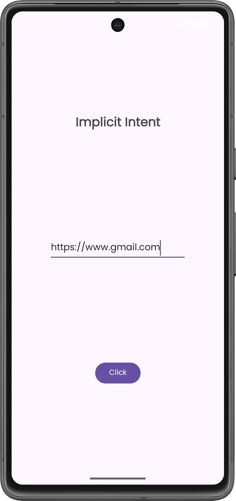
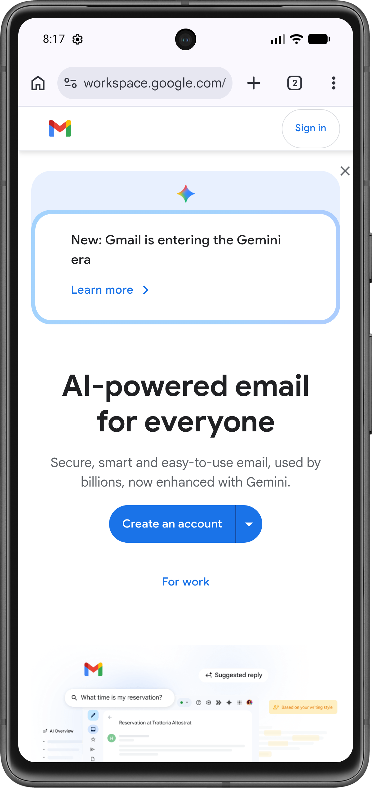

# Ex.No:3a Develop program to create a text field and a button “Navigate”. When you enter “www.gmail.com” and press navigate button it should open google page using Implicit Intents.

## AIM:

To create a navigate button using Implicit Intent to display the gmail page using Android Studio.

## EQUIPMENTS REQUIRED:

Latest Version Android Studio

## ALGORITHM:

1. **Start the project:** Create a new Android project in Android Studio.

2. **Design the UI:** In `activity_main.xml`, add an `EditText` (to accept the URL input) and a `Button` (to trigger the navigation).

3. **Initialize components:** In `MainActivity.java`, map the `EditText` and `Button` variables to their respective XML IDs using `findViewById()`.

4. **Set click listener:** Attach an `OnClickListener` to the button to listen for user click events.

5. **Get input:** Inside the `onClick` method, extract the text entered in the `EditText` and convert it to a string.

6. **Create implicit intent:** Instantiate an `Intent` with the action `Intent.ACTION_VIEW` and pass the parsed URL string using `Uri.parse()`.

7. **Start activity:** Call `startActivity(intent)` to trigger the OS to open the webpage in an available web browser.

8. **Stop:** Run and test the application.

## PROGRAM:

```
Program to print the text “Implicitintent”.
Developed by: Roopal C S
Registeration Number: 212223220088
```

### MainActivity.java

```java
package com.example.implicitintent;

import android.content.Intent;
import android.net.Uri;
import android.os.Bundle;
import android.widget.Button;
import android.widget.EditText;

import androidx.appcompat.app.AppCompatActivity;

public class MainActivity extends AppCompatActivity {

    @Override
    protected void onCreate(Bundle savedInstanceState) {

        super.onCreate(savedInstanceState);
        setContentView(R.layout.activity_main);

        EditText editText;
        Button button;

        button = findViewById(R.id.button);
        editText = findViewById(R.id.editText);

        button.setOnClickListener(view -> {
            String url=editText.getText().toString();
            Intent intent = new Intent(Intent.ACTION_VIEW, Uri.parse(url));
            startActivity(intent);
        });
    }
}
```

### activity_main.xml

```xml
<?xml version="1.0" encoding="utf-8"?>
<androidx.constraintlayout.widget.ConstraintLayout
    xmlns:android="http://schemas.android.com/apk/res/android"
    xmlns:app="http://schemas.android.com/apk/res-auto"
    xmlns:tools="http://schemas.android.com/tools"
    android:id="@+id/main"
    android:layout_width="match_parent"
    android:layout_height="match_parent"
    tools:context=".MainActivity">

    <TextView
        android:id="@+id/textView"
        android:layout_width="wrap_content"
        android:layout_height="wrap_content"
        android:fontFamily="@font/poppins"
        android:text="Implicit Intent"
        android:textSize="24sp"
        android:textStyle="bold"
        app:layout_constraintBottom_toTopOf="@+id/editText"
        app:layout_constraintEnd_toEndOf="parent"
        app:layout_constraintStart_toStartOf="parent"
        app:layout_constraintTop_toTopOf="parent" />

    <EditText
        android:id="@+id/editText"
        android:layout_width="wrap_content"
        android:layout_height="wrap_content"
        android:ems="10"
        android:fontFamily="@font/poppins"
        android:inputType="text"
        android:text="https://www.example.com"
        android:textAlignment="textStart"
        app:layout_constraintBottom_toBottomOf="parent"
        app:layout_constraintEnd_toEndOf="parent"
        app:layout_constraintStart_toStartOf="parent"
        app:layout_constraintTop_toTopOf="parent" />

    <Button
        android:id="@+id/button"
        android:layout_width="wrap_content"
        android:layout_height="wrap_content"
        android:fontFamily="@font/poppins"
        android:text="Click"
        app:layout_constraintBottom_toBottomOf="parent"
        app:layout_constraintEnd_toEndOf="parent"
        app:layout_constraintStart_toStartOf="parent"
        app:layout_constraintTop_toBottomOf="@+id/editText" />
</androidx.constraintlayout.widget.ConstraintLayout>
```

## OUTPUT




## RESULT

Thus a Simple Android Application create a navigate button using Implicit Intent to display the gmail page using Android Studio is developed and executed successfully.
